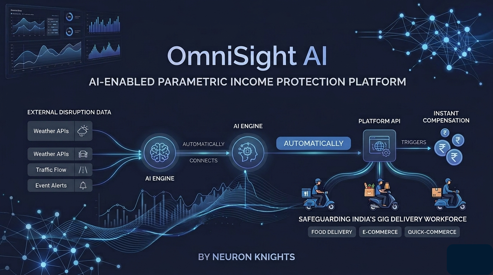
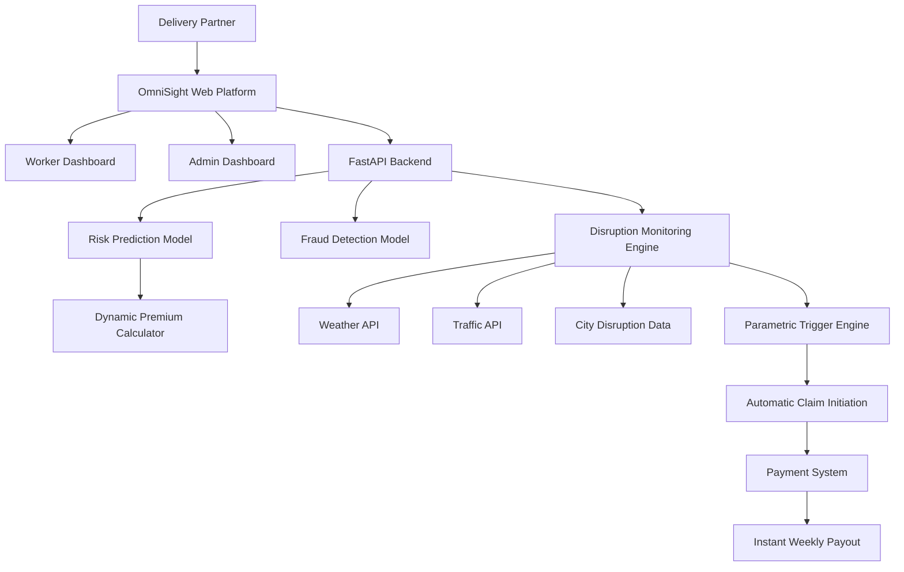
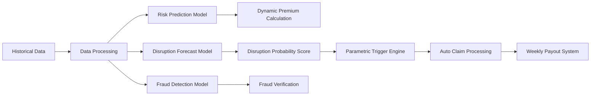
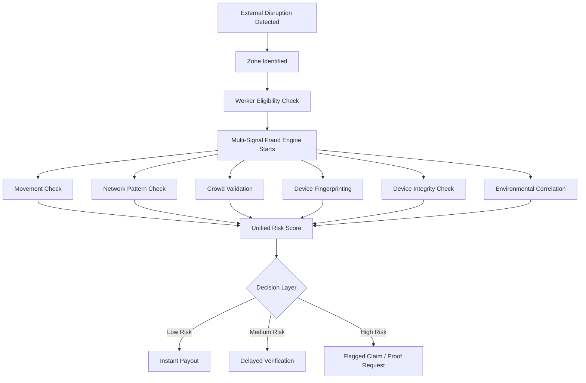
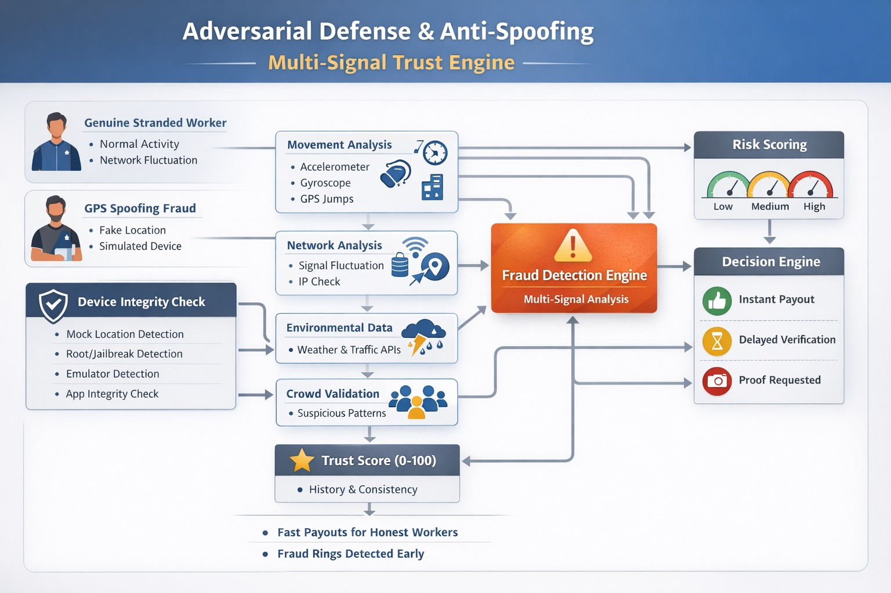

# OmniSight AI

### AI-Powered Income Protection Platform for India’s Gig Delivery Workforce

OmniSight AI is an **AI-enabled parametric income protection platform** designed to safeguard the livelihoods of India's gig delivery workforce. The platform automatically detects external disruptions that prevent delivery partners from working and **triggers instant compensation without requiring manual claims**.

It focuses on delivery partners working across **food delivery, e-commerce, and quick-commerce platforms**, ensuring they have financial protection against uncontrollable external events.

---

## Table of Contents

- Problem Statement
- Target Persona
- Our Solution
- Key Innovation
- Key Features
- AI & ML Workflow
- Financial Model
- Platform Design
- System Architecture
- Tech Stack
- System Workflow
- Adversarial Defense & Anti-Spoofing Strategy
- Scope & Exclusions
- Vision
- Impact
- Future Enhancements
- License

---

## Problem Statement

India’s platform-based delivery partners working with platforms such as **Zomato, Swiggy, Zepto, Amazon, Dunzo, and others** form the backbone of the digital economy.

However, external disruptions often result in **20–30% loss of monthly earnings**.

### Major Causes of Income Loss

#### Extreme Environmental Conditions
- Heavy rain  
- Floods  
- Extreme heat  
- Severe air pollution  

These conditions make outdoor work unsafe or impossible.

#### Social Disruptions
- Sudden curfews  
- Local strikes  
- Market shutdowns  
- Restricted delivery zones  

These prevent workers from accessing pickup or drop locations.

#### Technical Failures
- Platform app crashes  
- Server outages  
- Technical disruptions on delivery platforms  

These events can instantly stop deliveries and lead to loss of daily wages.

### The Core Issue

Gig workers **currently have no financial safety net** against these disruptions and must bear the full financial loss themselves.

---

# Target Persona  
## The Multi-Platform Delivery Partner

OmniSight AI focuses on delivery partners working across:

- Food Delivery — Zomato, Swiggy  
- E-commerce — Amazon, Flipkart  
- Grocery / Quick Commerce — Zepto, Blinkit  

### Operational Context
Delivery partners frequently operate across **multiple platforms simultaneously** and rely heavily on **zone accessibility during peak demand hours**.

### Earnings Cycle
Most gig delivery workers are paid **weekly**, making them extremely vulnerable to short-term disruptions.

### Key Pain Point
Even when workers are **ready and available to work**, external events can **block deliveries**, leading to **direct income loss**.

---

# Our Solution  
## Parametric Income Protection Platform

OmniSight AI introduces **AI-powered parametric insurance** tailored specifically for gig workers.

Instead of requiring manual claims, **payouts are automatically triggered when predefined disruption conditions occur**.

---

## Key Innovation

OmniSight AI introduces **Parametric Income Protection for Gig Workers**, where payouts are triggered automatically based on real-world disruption data rather than manual claims.

This eliminates traditional insurance delays and ensures gig workers receive **instant financial protection during disruptions.**

---

# Key Features

## Parametric Automation (Zero-Touch Claims)

Our system removes the traditional insurance claim process entirely.

### Real-time Trigger Monitoring
Continuous monitoring of external data sources including:

- Weather APIs
- Traffic APIs
- City disruption feeds

### Automatic Claim Initiation
If disruption parameters exceed predefined thresholds, the system:

- Detects the event
- Validates the affected delivery zone
- Initiates compensation automatically

### Instant Payouts
Workers receive payouts **within the same weekly payout cycle**, ensuring financial stability.

---

## AI & ML Integration Workflow

### Dynamic Premium Calculation
Machine Learning models adjust premiums weekly based on **hyper-local risk factors**, including:

- Historical water-logging zones
- Weather patterns
- Traffic disruption data
- Historical disruption frequency

### Predictive Risk Modeling
AI models forecast potential disruptions for the upcoming week using:

- Predictive weather models
- Historical disruption datasets
- Zone-level delivery activity

### Intelligent Fraud Detection
AI-driven anomaly detection identifies suspicious patterns such as:

- GPS spoofing
- Duplicate claims
- Fake disruption reports
- Abnormal delivery activity

---

# Financial Model

### Weekly Pricing Model

To align with gig economy workflows:

- Policies operate on **weekly cycles**
- Premiums are **low-cost and dynamically calculated**
- Workers can **opt-in or opt-out weekly**

This structure ensures **flexibility and affordability**.

---

# Platform Design

### Web-Based Platform

OmniSight AI is implemented as a **web platform** to ensure:

- Easy onboarding
- Compatibility with low-end devices
- No heavy application downloads
- Accessibility across all smartphones

---

## System Architecture

---

## AI Workflow

---
## Entity-Relationship Diagram (ERD)

---

# Tech Stack

## Frontend
- **React.js** – User interface for workers and admins  
- **TailwindCSS** – Modern responsive UI styling  

## Backend
- **Python** – Core backend language  
- **FastAPI** – High-performance API framework  

## AI / LLM Orchestration
- **LangChain** – AI-powered document intelligence and risk analysis  

## AI & Machine Learning
- **Scikit-Learn** – Risk prediction models  
- **Pandas** – Data processing and analysis  
- **NumPy** – Numerical computations  

## APIs & Integrations
- **Weather APIs** – Detect weather-related disruptions  
- **Traffic Data APIs** – Monitor delivery route conditions  
- **Simulated Payment Systems** – Trigger instant payouts  

## Database
- **SQL Database** – Stores worker data, risk profiles, and claims

---

# System Workflow

1. Worker registers and selects delivery zones  
2. AI model calculates **weekly premium** based on risk factors  
3. External APIs continuously monitor disruptions  
4. If a disruption crosses predefined thresholds:
   - Claim is triggered automatically  
   - AI verifies the event and zone  
5. Payment system processes **instant compensation payout**

---

# Adversarial Defense & Anti-Spoofing Strategy

## Our Approach: Multi-Signal Trust Engine

Simple GPS verification is easy to spoof. So instead of trusting only GPS, our system verifies a worker through a **Multi-Signal Trust Engine** built on:

* **Behavior**
* **Environment**
* **Network**
* **Device Integrity**

This means OmniSight AI does not depend on one signal. It checks whether the worker’s **entire digital footprint behaves like a genuinely disrupted delivery partner**, not just a phone reporting a fake location.

> If a worker is truly in a disruption zone, their full digital footprint behaves like a disrupted human, not just a GPS point on a map.

---

## Why This Pivot Is Needed

In a real adversarial scenario, a coordinated fraud ring can use GPS-spoofing tools to fake presence inside a severe disruption zone and trigger mass false payouts. If the platform relies only on basic GPS verification, the liquidity pool can be drained quickly.

To solve this, OmniSight AI adds a defense architecture that verifies not just **where the worker appears to be**, but also **how their device, movement, network, and surrounding conditions behave**.

---

## 1. Differentiation Strategy

### Genuine Stranded Worker

A genuinely stranded worker usually shows:

* Real GPS movement history inside the affected zone
* Consistent delivery activity before the disruption
* Traffic and weather data matching the reported location
* Device sensor patterns consistent with outdoor movement
* Network fluctuation during severe weather
* A trusted device environment with no spoofing indicators

### GPS Spoofing Fraud

A spoofed or fraudulent claim usually shows:

* Sudden location jump into a red-alert zone
* No historical delivery activity in that zone
* Device sensors showing little or no real movement
* Multiple workers reporting identical or highly similar coordinates
* High cluster density of workers claiming the same disruption at once
* Signs of mock location tools, rooted devices, or emulator usage

### How We Detect Real vs Fake Claims

We do **not** trust one indicator alone.

Instead, we combine:

* **Location**
* **Movement**
* **Environment**
* **Device Behavior**
* **Network Patterns**
* **Device Integrity**

This makes the system much harder to exploit because spoofing a single GPS signal is far easier than spoofing an entire behavioral stack.

---

## 2. Device Integrity Check

Before trusting any GPS, sensor, or network data, OmniSight AI first checks whether the device itself is trustworthy.

### Objective

Detect whether the device is real, untampered, and not using spoofing tools.

### What We Check

* **Mock Location Detection** -
  Detect if mock location is enabled, fake GPS apps are present, or GPS location does not match network location.

* **Root / Jailbreak Detection** -
  Check whether the device is rooted or jailbroken, since such devices can bypass security and modify app behavior.

* **Emulator / Virtual Device Detection** -
  Detect whether the app is running inside an emulator or virtual device often used for large-scale fraud.

* **App Integrity Verification** -
  Ensure the installed app is the official version and has not been modified or tampered with.

* **Play Integrity / SafetyNet APIs** -
  Use platform integrity signals to validate device certification, app authenticity, and secure runtime status.

* **SIM and Network Consistency** -
  Verify whether SIM presence, mobile network region, and reported location align logically.

* **Background Behavior Signals** -
  Detect suspicious patterns such as no sensor activity, fully static device behavior, or unrealistic runtime characteristics.

### Output of This Layer

This layer generates a **Device Trust Score**:

* **High Trust** → Normal processing
* **Medium Trust** → Additional verification
* **Low Trust** → Flagged or payout restricted

### Why This Matters

Without device integrity checks, GPS spoofing remains highly exploitable. With this layer, attackers must also:

* Hide root access
* Simulate real sensor data
* Maintain consistent network patterns
* Avoid emulator detection
* Use an untampered app build

This significantly increases the cost and complexity of coordinated fraud.

---

## 3. Data Points Analyzed Beyond Basic GPS

### A. Movement Intelligence

This is the core anti-spoof layer for physical behavior validation.

**Signals used:**

* Accelerometer data
* Gyroscope patterns
* GPS path continuity
* Sudden teleport detection

**Example:**
If GPS says the worker is moving through a flood zone, but accelerometer data shows no meaningful movement, the claim becomes suspicious.

---

### B. Network Signature Analysis

The system studies how connectivity behaves during real disruptions.

**Signals used:**

* Signal strength fluctuation during bad weather
* Packet loss patterns
* IP consistency checks
* Network switching such as 4G ↔ 3G ↔ unstable connection

**Interpretation:**

* **Spoofer at home** → stable Wi-Fi, predictable connectivity
* **Real worker in bad weather** → unstable mobile network, fluctuating signals

---

### C. Crowd Validation

This is one of the strongest indicators against coordinated fraud.

The system compares nearby workers claiming the same disruption.

**Example:**
If 10 workers are in the same zone and:

* 8 show normal activity
* 2 claim flood impact

then the minority claims may form a suspicious cluster.

This helps detect coordinated fraud rings rather than isolated genuine cases.

---

### D. Time-Based Pattern Detection

The system studies suspicious repetition over time.

**Checks include:**

* Same users claiming repeatedly every week
* Same timing patterns across claims
* Repeated exploitation of similar disruption windows

This helps identify organized fraud behavior.

---

### E. Device Fingerprinting

The system looks for technical overlap across accounts.

**Checks include:**

* Same device used across multiple worker accounts
* Emulator signatures
* Repeated device-level identifiers linked to flagged claims

This is useful for identifying scaled fraud operations using shared infrastructure.

---

### F. Environmental Correlation

This is a key AI layer in OmniSight AI.

The system matches:

* Weather API data
* Traffic API data
* Delivery activity data
* Zone-level disruption history

**Example:**
If weather APIs report severe rainfall but nearby deliveries are still continuing normally, fraud probability increases.

This ensures payouts are based on real delivery disruption, not just raw weather alerts.

---

## 4. Final Architecture

### Fraud-Aware Payout Flow

---

## 5. Decision Engine

After all checks are completed, the system generates a unified **Risk Score** and takes one of the following actions:

| Risk Level      | Action                                          |
| --------------- | ----------------------------------------------- |
| **Low Risk**    | Instant payout                                  |
| **Medium Risk** | Delayed payout with passive verification checks |
| **High Risk**   | Claim flagged and additional proof requested    |

This preserves automation while protecting the liquidity pool from coordinated attacks.

---

## 6. UX Balance — Protecting Honest Workers

The anti-fraud workflow is designed to protect the platform **without unfairly harming genuine gig workers**.

If a claim is flagged:

* The worker is **not immediately rejected**
* The system uses **graduated verification**
* Honest workers facing real weather or network disruptions still get a fair path

### Worker-Friendly Handling

| Situation         | System Response                                     |
| ----------------- | --------------------------------------------------- |
| Low-risk claim    | Instant payout                                      |
| Medium-risk claim | Silent background verification, no hard penalty     |
| High-risk claim   | Request photo/video proof or route to manual review |

### Why This Balance Matters

Bad weather itself can cause:

* GPS instability
* Weak network signals
* Delayed synchronization
* Incomplete sensor patterns

So the platform does not treat every anomaly as fraud. Instead, it separates **uncertain claims** from **high-confidence fraud patterns**.

This protects both worker trust and platform sustainability.

---

## 7. Fallback Proof Layer

Photo or video proof is **not the default claim process**.

That would go against the zero-touch parametric protection model.

Instead, proof submission is used only as a **fallback layer** for high-risk cases.

### Why This Works

* Keeps the experience automated for most honest workers
* Adds human-verifiable evidence only when needed
* Prevents the platform from turning into a manual claims workflow

So, photo/video verification becomes a **targeted fraud-control layer**, not a standard user requirement.

---

## 8. Trust Score per Worker

Each worker receives a **Trust Score (0–100)** based on:

* Past behavior
* Historical fraud flags
* Delivery consistency
* Device trust history
* Prior claim reliability

### Trust Score Impact

* **High Trust** → Faster payouts, lower friction
* **Medium Trust** → Standard processing
* **Low Trust** → Stronger checks and tighter payout controls

This allows OmniSight AI to improve over time and remain fair to reliable workers.

---

## 9. Why This Strategy Is Effective Against a Fraud Ring

In a coordinated attack, fraudsters may spoof GPS at scale. But spoofing one signal is much easier than spoofing an entire behavioral stack.

To bypass OmniSight AI at scale, attackers would need to simultaneously fake:

* GPS position
* Real movement sensor data
* Network instability patterns
* Delivery activity consistency
* Device trust and app integrity
* Crowd-level claim realism
* Environmental match with actual zone conditions

This sharply increases the cost, complexity, and coordination effort required for fraud, making large-scale attacks far less practical.

---

## 10. Result

This adversarial defense architecture ensures that:

* Honest workers continue receiving fast payouts
* Fraud rings are detected early
* Coordinated spoofing becomes difficult to scale
* Liquidity pools remain financially protected
* Parametric protection stays automated without becoming a manual claims system

OmniSight AI therefore balances **fraud prevention**, **worker fairness**, and **operational automation** in a way that is practical for real-world gig workforce protection.

---

## Summary

OmniSight AI moves beyond basic GPS verification by introducing a **Multi-Signal Trust Engine** that combines:

* Location validation
* Movement intelligence
* Network behavior analysis
* Device integrity checks
* Environmental correlation
* Crowd-based anomaly detection

This creates a stronger, smarter, and more scalable anti-spoofing system that can defend against coordinated fraud while still delivering a worker-friendly experience.

---
## AntiSpoofing System Block Diagram

---

# Scope & Exclusions

### Covered
Loss of income caused by **external disruptions**, including:

- Extreme weather
- Government curfews
- Social disruptions
- Platform technical outages

### Not Covered

In accordance with regulatory constraints, the platform **does not cover**:

- Health insurance
- Life insurance
- Personal accidents
- Vehicle damage or repair

---

# Vision

OmniSight AI aims to create **financial resilience for India's gig workforce** by providing:

- Automated protection  
- AI-driven risk prediction  
- Fast parametric payouts  

The goal is to **empower delivery partners with financial stability**, ensuring that **external disruptions never translate into financial insecurity**.

---

# Impact

If deployed at scale, OmniSight AI could protect:

- **10M+ gig workers in India**
- Prevent **20–30% income volatility**
- Provide **real-time financial resilience**

---

# Future Enhancements

- Integration with gig platforms for real-time delivery activity validation  
- Blockchain-based claim transparency  
- UPI-based instant payouts  
- Zone-level risk heatmaps  
- Government disaster alert integration  

---

# License

This project is developed for **innovation and research purposes** and can be extended into a production-grade system with regulatory approvals.
MIT License
---
