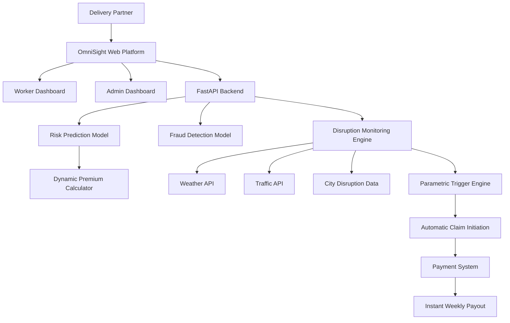
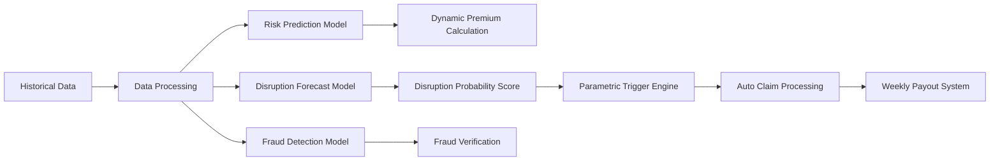

# OmniSight AI

### AI-Powered Income Protection Platform for India’s Gig Delivery Workforce

OmniSight AI is an **AI-enabled parametric income protection platform** designed to safeguard the livelihoods of India's gig delivery workforce. The platform automatically detects external disruptions that prevent delivery partners from working and **triggers instant compensation without requiring manual claims**.

It focuses on delivery partners working across **food delivery, e-commerce, and quick-commerce platforms**, ensuring they have financial protection against uncontrollable external events.

---

## Table of Contents

- Problem Statement
- Target Persona
- Our Solution
- Key Innovation
- Key Features
- AI & ML Workflow
- Financial Model
- Platform Design
- System Architecture
- Tech Stack
- System Workflow
- Scope & Exclusions
- Vision
- Impact
- Future Enhancements
- License

---

## Problem Statement

India’s platform-based delivery partners working with platforms such as **Zomato, Swiggy, Zepto, Amazon, Dunzo, and others** form the backbone of the digital economy.

However, external disruptions often result in **20–30% loss of monthly earnings**.

### Major Causes of Income Loss

#### Extreme Environmental Conditions
- Heavy rain  
- Floods  
- Extreme heat  
- Severe air pollution  

These conditions make outdoor work unsafe or impossible.

#### Social Disruptions
- Sudden curfews  
- Local strikes  
- Market shutdowns  
- Restricted delivery zones  

These prevent workers from accessing pickup or drop locations.

#### Technical Failures
- Platform app crashes  
- Server outages  
- Technical disruptions on delivery platforms  

These events can instantly stop deliveries and lead to loss of daily wages.

### The Core Issue

Gig workers **currently have no financial safety net** against these disruptions and must bear the full financial loss themselves.

---

# Target Persona  
## The Multi-Platform Delivery Partner

OmniSight AI focuses on delivery partners working across:

- Food Delivery — Zomato, Swiggy  
- E-commerce — Amazon, Flipkart  
- Grocery / Quick Commerce — Zepto, Blinkit  

### Operational Context
Delivery partners frequently operate across **multiple platforms simultaneously** and rely heavily on **zone accessibility during peak demand hours**.

### Earnings Cycle
Most gig delivery workers are paid **weekly**, making them extremely vulnerable to short-term disruptions.

### Key Pain Point
Even when workers are **ready and available to work**, external events can **block deliveries**, leading to **direct income loss**.

---

# Our Solution  
## Parametric Income Protection Platform

OmniSight AI introduces **AI-powered parametric insurance** tailored specifically for gig workers.

Instead of requiring manual claims, **payouts are automatically triggered when predefined disruption conditions occur**.

---

## Key Innovation

OmniSight AI introduces **Parametric Income Protection for Gig Workers**, where payouts are triggered automatically based on real-world disruption data rather than manual claims.

This eliminates traditional insurance delays and ensures gig workers receive **instant financial protection during disruptions.**

---

# Key Features

## Parametric Automation (Zero-Touch Claims)

Our system removes the traditional insurance claim process entirely.

### Real-time Trigger Monitoring
Continuous monitoring of external data sources including:

- Weather APIs
- Traffic APIs
- City disruption feeds

### Automatic Claim Initiation
If disruption parameters exceed predefined thresholds, the system:

- Detects the event
- Validates the affected delivery zone
- Initiates compensation automatically

### Instant Payouts
Workers receive payouts **within the same weekly payout cycle**, ensuring financial stability.

---

## AI & ML Integration Workflow

### Dynamic Premium Calculation
Machine Learning models adjust premiums weekly based on **hyper-local risk factors**, including:

- Historical water-logging zones
- Weather patterns
- Traffic disruption data
- Historical disruption frequency

### Predictive Risk Modeling
AI models forecast potential disruptions for the upcoming week using:

- Predictive weather models
- Historical disruption datasets
- Zone-level delivery activity

### Intelligent Fraud Detection
AI-driven anomaly detection identifies suspicious patterns such as:

- GPS spoofing
- Duplicate claims
- Fake disruption reports
- Abnormal delivery activity

---

# Financial Model

### Weekly Pricing Model

To align with gig economy workflows:

- Policies operate on **weekly cycles**
- Premiums are **low-cost and dynamically calculated**
- Workers can **opt-in or opt-out weekly**

This structure ensures **flexibility and affordability**.

---

# Platform Design

### Web-Based Platform

OmniSight AI is implemented as a **web platform** to ensure:

- Easy onboarding
- Compatibility with low-end devices
- No heavy application downloads
- Accessibility across all smartphones

---

## System Architecture

---

## AI Workflow

---
## Entity-Relationship Diagram (ERD)

---

# Tech Stack

## Frontend
- **React.js** – User interface for workers and admins  
- **TailwindCSS** – Modern responsive UI styling  

## Backend
- **Python** – Core backend language  
- **FastAPI** – High-performance API framework  

## AI / LLM Orchestration
- **LangChain** – AI-powered document intelligence and risk analysis  

## AI & Machine Learning
- **Scikit-Learn** – Risk prediction models  
- **Pandas** – Data processing and analysis  
- **NumPy** – Numerical computations  

## APIs & Integrations
- **Weather APIs** – Detect weather-related disruptions  
- **Traffic Data APIs** – Monitor delivery route conditions  
- **Simulated Payment Systems** – Trigger instant payouts  

## Database
- **SQL Database** – Stores worker data, risk profiles, and claims

---

# System Workflow

1. Worker registers and selects delivery zones  
2. AI model calculates **weekly premium** based on risk factors  
3. External APIs continuously monitor disruptions  
4. If a disruption crosses predefined thresholds:
   - Claim is triggered automatically  
   - AI verifies the event and zone  
5. Payment system processes **instant compensation payout**

---

# Scope & Exclusions

### Covered
Loss of income caused by **external disruptions**, including:

- Extreme weather
- Government curfews
- Social disruptions
- Platform technical outages

### Not Covered

In accordance with regulatory constraints, the platform **does not cover**:

- Health insurance
- Life insurance
- Personal accidents
- Vehicle damage or repair

---

# Vision

OmniSight AI aims to create **financial resilience for India's gig workforce** by providing:

- Automated protection  
- AI-driven risk prediction  
- Fast parametric payouts  

The goal is to **empower delivery partners with financial stability**, ensuring that **external disruptions never translate into financial insecurity**.

---

# Impact

If deployed at scale, OmniSight AI could protect:

- **10M+ gig workers in India**
- Prevent **20–30% income volatility**
- Provide **real-time financial resilience**

---

# Future Enhancements

- Integration with gig platforms for real-time delivery activity validation  
- Blockchain-based claim transparency  
- UPI-based instant payouts  
- Zone-level risk heatmaps  
- Government disaster alert integration  

---

# License

This project is developed for **innovation and research purposes** and can be extended into a production-grade system with regulatory approvals.
MIT License
---
