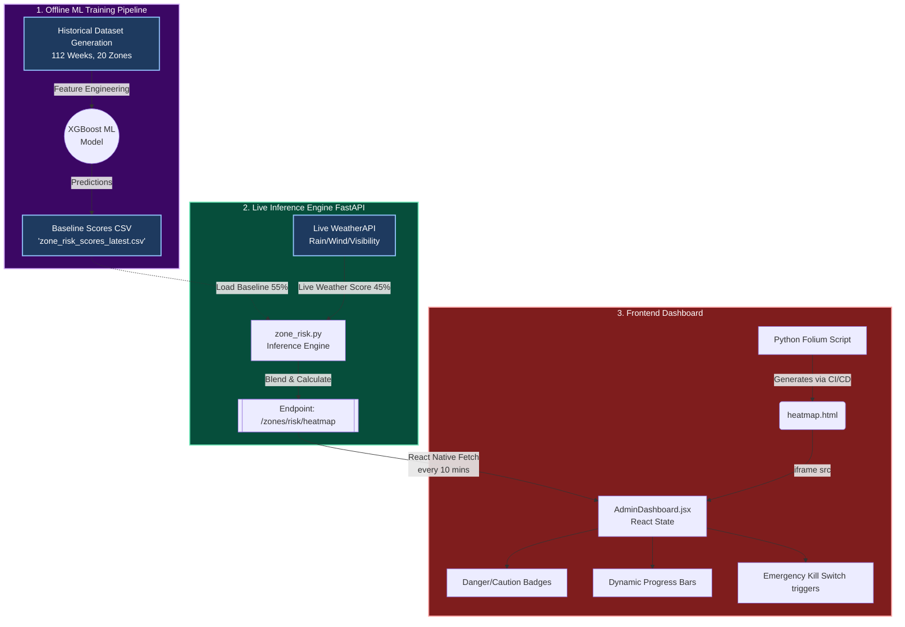

# OmniSight AI: Risk Prediction Workflow

This document illustrates the precise data flow architecture powering the OmniSight AI Risk Prediction Model across the 20 Pan-India zones.

## Breakdown of the Process

1. **The XGBoost Brain (Offline)**: We generate 112 weeks of historical weather and risk behavior specific to 20 zones across Mumbai, Delhi, Kolkata, and Chennai. The XGBoost model calculates long-term baseline trends (weight = 55%).
2. **The Pulse (Live Weather)**: Every 10 minutes, the backend queries live metrics (rainfall in mm, wind in kph, visibility). It generates a severe weather spike score (weight = 45%).
3. **The Blend (The Engine)**: `zone_risk.py` instantly fuses the XGBoost baseline and the Live Weather score into a 0-100 Danger Metric.
4. **The UI (React Dashboard)**: `AdminDashboard.jsx` hits the API, bringing the live scores into React. At the exact same time, it natively renders the HTML `iframe` map inside the application.
